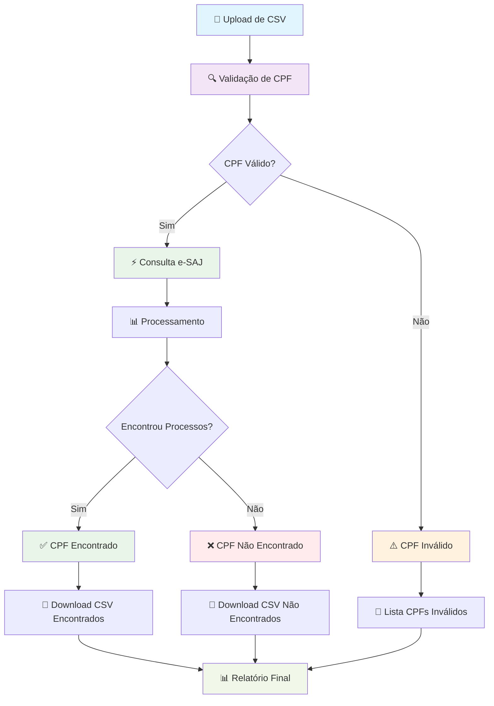

# 🏛️ **Revisa Consulta CPF e-SAJ**

Interface web moderna para consulta em lote de CPFs no sistema e-SAJ do Tribunal de Justiça de São Paulo. Permite upload de arquivo CSV, processamento sequencial das consultas e download dos resultados.

## 📚 **Documentação Completa**

- **[📋 Documentação Completa](DOCUMENTACAO_COMPLETA.md)** - Guia técnico completo
- **[🔧 Especificação Técnica](ESPECIFICACAO_TECNICA.md)** - Detalhes técnicos e arquitetura  
- **[👤 Guia do Usuário](GUIA_USUARIO.md)** - Manual para usuários finais
- **[⚙️ Configuração](config.example.py)** - Arquivo de configuração de exemplo

## ✨ **Funcionalidades**



### 🎯 **Funcionalidades Principais**
- **📁 Upload de CSV** com colunas `nome` e `cpf`
- **🔍 Validação de CPF** com algoritmo de verificação
- **⚡ Consulta sequencial** no e-SAJ TJSP
- **📊 Interface em tempo real** com progress bar
- **💾 Download de resultados** em CSV
- **👀 Visualização** de CPFs não encontrados
- **⚙️ Configurações** de delay e detalhes

### 🆕 **Melhorias v1.3.0**
- **🐛 Erro TypeError corrigido** na função `reformatar_dados_para_csv`
- **📋 Preview de dados** antes do download
- **🎨 Interface otimizada** com melhor organização
- **⚡ Performance melhorada** com código modularizado

## 🚀 **Execução Rápida**

### **Opção 1: Script Automático**
```bash
chmod +x run.sh
./run.sh
```

### **Opção 2: Manual**
```bash
python -m venv venv
source venv/bin/activate  # Linux/Mac
# ou
venv\Scripts\activate     # Windows
pip install -r requirements.txt
streamlit run app.py
```

**Acesso**: http://localhost:8501

## 📁 **Estrutura do Projeto**

```
UI-streamlit/
├── app.py                           # Aplicação principal Streamlit
├── requirements.txt                 # Dependências Python
├── requirements-dev.txt             # Dependências de desenvolvimento
├── run.sh                          # Script de execução
├── Dockerfile                      # Configuração Docker
├── docker-compose.yml              # Orquestração Docker
├── .streamlit/
│   ├── config.toml                 # Configuração Streamlit
│   └── secrets.toml.example        # Exemplo de secrets
├── src/                            # Código fonte modularizado
│   ├── __init__.py                 # Inicialização do pacote
│   ├── config.py                   # Configurações da aplicação
│   └── utils.py                    # Funções utilitárias
├── docs/                           # Documentação
│   ├── DOCUMENTACAO_COMPLETA.md    # Documentação técnica completa
│   ├── ESPECIFICACAO_TECNICA.md    # Especificação técnica
│   ├── GUIA_USUARIO.md             # Guia do usuário
│   ├── INDICE_DOCUMENTACAO.md      # Índice da documentação
│   └── RESUMO_DOCUMENTACAO.md      # Resumo da documentação
├── data/                           # Dados
│   ├── entrada/                    # Arquivos de entrada
│   └── saida/                      # Resultados gerados
├── tests/                          # Testes automatizados
│   └── test_utils.py               # Testes das funções utilitárias
├── assets/                         # Recursos estáticos
│   ├── imagens/                    # Imagens
│   └── estilos/                    # Estilos CSS
├── .github/                        # Configurações GitHub
│   └── workflows/
│       └── ci.yml                  # Pipeline CI/CD
├── .gitignore                      # Arquivos ignorados pelo Git
├── CHANGELOG.md                    # Registro de mudanças
├── CONTRIBUTING.md                 # Guia de contribuição
└── LICENSE                         # Licença do projeto
```

## 🏗️ **Arquitetura e Melhores Práticas**

Este projeto segue as **melhores práticas recomendadas** para aplicações Streamlit:

### ✅ **Organização Modular**
- **Separação de responsabilidades**: Código dividido em módulos (`src/`)
- **Configuração centralizada**: Arquivo `config.py` para todas as configurações
- **Funções utilitárias**: Módulo `utils.py` com funções reutilizáveis

### ✅ **Estrutura Profissional**
- **Documentação completa**: Pasta `docs/` com toda a documentação
- **Testes automatizados**: Pasta `tests/` com testes unitários
- **CI/CD**: Pipeline GitHub Actions para testes e validação
- **Docker**: Suporte completo para containerização

### ✅ **Preparado para Produção**
- **Streamlit Community Cloud**: Estrutura otimizada para deploy
- **GitHub**: Organização adequada para repositório público
- **Logging**: Sistema de logs para monitoramento
- **Error Handling**: Tratamento robusto de erros

### ✅ **Manutenibilidade**
- **Código limpo**: Seguindo padrões Python
- **Type hints**: Tipagem para melhor documentação
- **Modularização**: Fácil manutenção e extensão
- **Documentação**: Guias completos para usuários e desenvolvedores

## 📊 **Formato do CSV de Entrada**

O arquivo CSV deve conter as colunas `Nome` e `CPF` (case-insensitive):

| Nome | CPF |
|------|-----|
| João Silva | 12345678901 |
| Maria Santos | 98765432100 |
| Pedro Costa | 11122233344 |

**Validação de CPF:**
- Aceita 9-11 dígitos
- Preenche automaticamente com zeros à esquerda
- Valida dígitos verificadores

## 📥 **Arquivos de Saída**

### **CPFs Encontrados**
- `cpfs_encontrados_YYYYMMDD_HHMMSS.csv`
- **Formato**: Uma linha por processo encontrado
- **Colunas**: CPF, Nome, Nome_Extraido, Sequencia_Processo, Numero_Processo, Classe_Processo, Data_Processo, Data_Consulta

### **CPFs Não Encontrados**
- `cpfs_nao_encontrados_YYYYMMDD_HHMMSS.csv`
- **Colunas**: nome, cpf, motivo, data_consulta

## ⚙️ **Configurações**

- **Delay entre consultas**: 1-5 segundos (configurável)
- **Mostrar detalhes**: Exibir progresso individual das consultas
- **Timeout**: 30 segundos por consulta

## 🔧 **Funcionalidades Técnicas**

### **Validação de CPF**
- Algoritmo completo de verificação de dígitos
- Normalização automática (preenchimento com zeros)
- Filtragem de CPFs inválidos

### **Consulta e-SAJ**
- Headers anti-bot para evitar bloqueios
- Parsing HTML para extrair dados dos processos
- Tratamento de erros e timeouts

### **Interface Responsiva**
- Design moderno com CSS personalizado
- Métricas em tempo real
- Progress bar visual
- Preview dos resultados

## 🛡️ **Segurança e Boas Práticas**

- **Rate limiting** com delay configurável entre consultas
- **Validação robusta** de entrada de dados
- **Tratamento de erros** completo
- **Headers realistas** para evitar detecção de bot

## 📈 **Performance**

- **Throughput**: ~30 CPFs/minuto (delay 2s)
- **Latência**: 2-5 segundos por consulta
- **Memória**: ~50MB para 1000 CPFs
- **Rate Limiting**: Respeita limites do e-SAJ
- **Processamento sequencial** para evitar sobrecarga do servidor
- **Interface responsiva** mesmo com grandes volumes

## 🐛 **Solução de Problemas**

### **Erro de Conexão**
- Verifique sua conexão com a internet
- Aumente o delay entre consultas
- Verifique se o e-SAJ está acessível

### **CPFs Inválidos**
- Verifique o formato dos CPFs no CSV
- Use apenas números (sem pontos, traços, etc.)
- CPFs devem ter 11 dígitos

### **Timeout de Consulta**
- Aumente o delay entre consultas
- Verifique a estabilidade da conexão
- Reduza o número de CPFs por lote

## 📞 **Suporte**

Para dúvidas ou problemas:
1. **Consulte a documentação**: [Guia do Usuário](GUIA_USUARIO.md)
2. **Verifique os logs**: Arquivo `consulta_esaj.log`
3. **Teste com poucos CPFs** primeiro
4. **Consulte a documentação técnica**: [Documentação Completa](DOCUMENTACAO_COMPLETA.md)

---

**Versão**: 1.2.0  
**Data**: 2023-09-21  
**Status**: Produção  
**🎯 Desenvolvido com ❤️ para o projeto Revisa**
