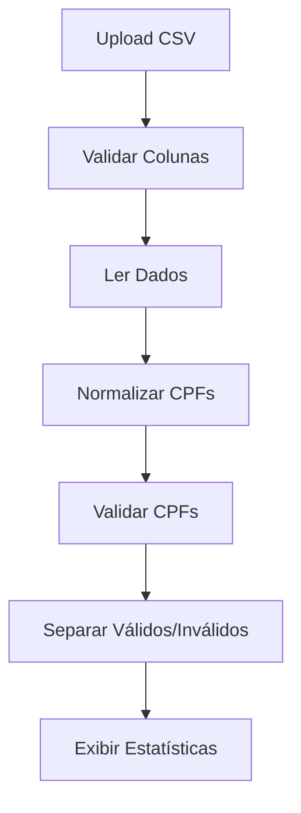
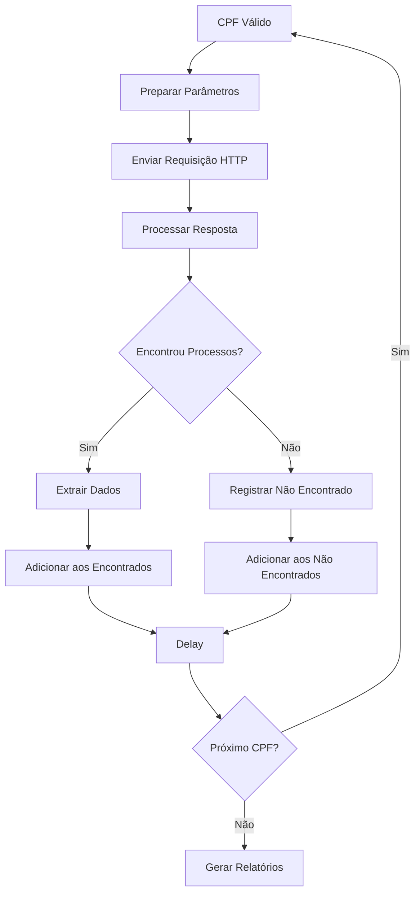

# 🔧 Especificação Técnica - Revisa Consulta CPF e-SAJ

## 📋 Resumo Executivo

A aplicação **Revisa Consulta CPF e-SAJ** é uma solução web desenvolvida em Python/Streamlit para consulta automatizada de CPFs no sistema e-SAJ do Tribunal de Justiça de São Paulo. A aplicação processa arquivos CSV em lote, valida CPFs, realiza consultas HTTP sequenciais e gera relatórios estruturados.

## 🎯 Objetivos

### Objetivo Principal
Automatizar a consulta de CPFs em lote no sistema e-SAJ TJSP, substituindo consultas manuais por um processo automatizado e eficiente.

### Objetivos Secundários
- Validar CPFs antes da consulta
- Gerar relatórios estruturados (CSV)
- Manter logs detalhados das operações
- Interface amigável para usuários não técnicos
- Respeitar limites de rate do servidor e-SAJ

## 🏗️ Arquitetura Técnica

### Stack Tecnológico
- **Frontend**: Streamlit (Python)
- **Backend**: Python 3.8+
- **HTTP Client**: Requests
- **Data Processing**: Pandas
- **Logging**: Python Logging
- **Regex**: Python re

### Padrões de Desenvolvimento
- **MVC**: Separação de responsabilidades
- **DRY**: Don't Repeat Yourself
- **SOLID**: Princípios de design
- **Error Handling**: Tratamento robusto de erros

## 📊 Especificação de Dados

### Entrada (Input)
```yaml
Formato: CSV
Encoding: UTF-8
Delimitador: Vírgula
Colunas Obrigatórias:
  - Nome/nome: String (até 255 caracteres)
  - CPF/cpf: String (9-11 dígitos)
Validações:
  - CPF: Algoritmo oficial de verificação
  - Nome: Não vazio, sem caracteres especiais perigosos
```

### Saída (Output)
```yaml
CSV Encontrados:
  - CPF: String (11 dígitos)
  - Nome: String
  - Nome_Extraido: String
  - Sequencia_Processo: Integer
  - Numero_Processo: String
  - Classe_Processo: String
  - Data_Processo: String (DD/MM/YYYY)
  - Data_Consulta: String (YYYY-MM-DD HH:MM:SS)

CSV Não Encontrados:
  - nome: String
  - cpf: String (11 dígitos)
  - motivo: String
  - data_consulta: String (YYYY-MM-DD HH:MM:SS)
```

## 🔄 Fluxo de Processamento

### 1. Upload e Validação


### 2. Consulta e-SAJ


## 🌐 Integração e-SAJ

### Endpoint
```
URL: https://esaj.tjsp.jus.br/cpopg/search.do
Método: GET
Parâmetros:
  - conversationId: ""
  - cbPesquisa: "DOCPARTE"
  - dadosConsulta.valorConsulta: CPF
  - consultaDeRequisitorios: "true"
```

### Headers HTTP
```http
User-Agent: Mozilla/5.0 (Macintosh; Intel Mac OS X 10_15_7) AppleWebKit/537.36 (KHTML, like Gecko) Chrome/139.0.0.0 Safari/537.36
Referer: https://esaj.tjsp.jus.br/cpopg/abrirConsultaDeRequisitorios.do
Accept: text/html,application/xhtml+xml,application/xml;q=0.9,image/avif,image/webp,image/apng,*/*;q=0.8
Accept-Language: pt-BR,pt;q=0.9,en-US;q=0.8,en;q=0.7
Accept-Encoding: gzip, deflate, br, zstd
Content-Type: application/x-www-form-urlencoded
Connection: keep-alive
Sec-Fetch-Dest: document
Sec-Fetch-Mode: navigate
Sec-Fetch-Site: same-origin
Origin: https://esaj.tjsp.jus.br
Cache-Control: max-age=0
Upgrade-Insecure-Requests: 1
```

### Resposta Esperada
```html
<!-- Estrutura HTML do e-SAJ -->
<div class="unj-base-alt nomeParte">Nome do Requerente</div>
<li>
  <div id="divProcesso...">
    <a class="linkProcesso">1234567-89.2023.8.26.0500</a>
    <div class="classeProcesso">Precatório</div>
    <div class="dataLocalDistribuicaoProcesso">15/03/2023 - DEPRE</div>
  </div>
</li>
```

## 🔍 Algoritmos de Processamento

### Normalização de CPF
```python
def normalizar_cpf(cpf: str) -> str:
    """
    Algoritmo de normalização de CPF
    
    Entrada: CPF em qualquer formato (9-11 dígitos)
    Saída: CPF com 11 dígitos (zeros à esquerda)
    
    Complexidade: O(n) onde n é o tamanho da string
    """
    # 1. Remover caracteres não numéricos
    cpf_limpo = re.sub(r'\D', '', str(cpf))
    
    # 2. Aplicar regras de normalização
    if len(cpf_limpo) < 11:
        return cpf_limpo.zfill(11)  # Preencher com zeros à esquerda
    elif len(cpf_limpo) == 11:
        return cpf_limpo  # Manter como está
    else:
        return cpf_limpo[:11]  # Truncar se maior que 11
```

### Validação de CPF
```python
def validar_cpf(cpf: str) -> bool:
    """
    Algoritmo de validação de CPF (oficial)
    
    Entrada: CPF normalizado (11 dígitos)
    Saída: True se válido, False caso contrário
    
    Complexidade: O(1) - tempo constante
    """
    # 1. Verificar formato básico
    if len(cpf) != 11 or cpf == cpf[0] * 11:
        return False
    
    # 2. Calcular primeiro dígito verificador
    soma = sum(int(cpf[i]) * (10 - i) for i in range(9))
    resto = soma % 11
    digito1 = 0 if resto < 2 else 11 - resto
    
    # 3. Calcular segundo dígito verificador
    soma = sum(int(cpf[i]) * (11 - i) for i in range(10))
    resto = soma % 11
    digito2 = 0 if resto < 2 else 11 - resto
    
    # 4. Verificar dígitos
    return cpf[-2:] == f"{digito1}{digito2}"
```

### Extração de Dados HTML
```python
def extrair_processos_html(html: str) -> List[Dict]:
    """
    Extrai informações dos processos do HTML do e-SAJ
    
    Entrada: HTML da resposta do e-SAJ
    Saída: Lista de dicionários com dados dos processos
    
    Complexidade: O(n) onde n é o tamanho do HTML
    """
    processos = []
    
    # 1. Buscar todas as seções de processo
    processos_matches = re.findall(
        r'<li>\s*<div id="divProcesso[^"]*"[^>]*>.*?</div>\s*</li>', 
        html, 
        re.DOTALL
    )
    
    # 2. Extrair dados de cada processo
    for processo_html in processos_matches:
        numero = re.search(r'class="linkProcesso"[^>]*>\s*([^<\s]+)', processo_html)
        classe = re.search(r'<div class="classeProcesso">([^<]+)</div>', processo_html)
        data = re.search(r'<div class="dataLocalDistribuicaoProcesso">([^<]+?)\s*-', processo_html)
        
        if numero and classe and data:
            processos.append({
                "numero": numero.group(1).strip(),
                "classe": classe.group(1).strip(),
                "data": data.group(1).strip()
            })
    
    return processos
```

## 📈 Performance e Otimização

### Métricas de Performance
- **Throughput**: ~30 CPFs/minuto (com delay de 2s)
- **Latência**: 2-5 segundos por consulta
- **Memória**: ~50MB para 1000 CPFs
- **CPU**: Baixo uso (I/O bound)

### Otimizações Implementadas
1. **Processamento Sequencial**: Evita sobrecarga do servidor
2. **Delay Configurável**: Respeita limites de rate
3. **Headers Otimizados**: Simula navegador real
4. **Regex Compilado**: Reutiliza padrões compilados
5. **Logging Eficiente**: Registra apenas informações essenciais

### Limitações Conhecidas
- **Rate Limiting**: Delay mínimo de 1 segundo
- **Timeout**: 30 segundos por consulta
- **Tamanho de Arquivo**: Máximo 10MB
- **Concorrência**: Processamento sequencial apenas

## 🔒 Segurança e Compliance

### Medidas de Segurança
1. **Headers Anti-Bot**: Simula navegador real
2. **Rate Limiting**: Respeita limites do servidor
3. **Validação de Entrada**: Sanitiza dados
4. **Logging de Segurança**: Registra tentativas de acesso
5. **Timeout**: Evita conexões longas

### Compliance
- **LGPD**: Não armazena dados pessoais permanentemente
- **Acesso Público**: Usa apenas dados públicos do e-SAJ
- **Logs**: Contêm informações sensíveis (não compartilhar)

## 🧪 Testes e Qualidade

### Estratégia de Testes
1. **Testes Unitários**: Funções individuais
2. **Testes de Integração**: Fluxo completo
3. **Testes de Performance**: Carga e stress
4. **Testes de Segurança**: Validação de entrada

### Casos de Teste
```python
# Teste de normalização de CPF
assert normalizar_cpf("123456789") == "00123456789"
assert normalizar_cpf("12345678901") == "12345678901"
assert normalizar_cpf("123456789012") == "12345678901"

# Teste de validação de CPF
assert validar_cpf("11144477735") == True  # CPF válido
assert validar_cpf("11111111111") == False  # Sequência repetida
assert validar_cpf("12345678901") == False  # CPF inválido

# Teste de extração HTML
html_teste = '<div class="unj-base-alt nomeParte">João Silva</div>'
assert extrair_nome_html(html_teste) == "João Silva"
```

## 📊 Monitoramento e Logs

### Estrutura de Logs
```
2023-09-21 10:30:15,123 - INFO - 🔍 Iniciando consulta CPF: 12345678901 - João Silva
2023-09-21 10:30:15,124 - INFO - 📡 Enviando requisição para: https://esaj.tjsp.jus.br/cpopg/search.do
2023-09-21 10:30:15,125 - INFO - 📋 Parâmetros: {'conversationId': '', 'cbPesquisa': 'DOCPARTE', 'dadosConsulta.valorConsulta': '12345678901', 'consultaDeRequisitorios': 'true'}
2023-09-21 10:30:16,234 - INFO - 📊 Status da resposta: 200
2023-09-21 10:30:16,235 - INFO - 📏 Tamanho da resposta: 75240 caracteres
2023-09-21 10:30:16,236 - INFO - ✅ Processos encontrados para CPF: 12345678901
2023-09-21 10:30:16,237 - INFO - 👤 Nome extraído: João Silva Santos
2023-09-21 10:30:16,238 - INFO - 📋 Encontradas 2 seções de processo
2023-09-21 10:30:16,239 - INFO - ✅ Processo extraído: 1234567-89.2023.8.26.0500 - Precatório - 15/03/2023
```

### Métricas de Monitoramento
- **Taxa de Sucesso**: % de consultas bem-sucedidas
- **Tempo de Resposta**: Latência média por consulta
- **Erros**: Contagem por tipo de erro
- **Throughput**: CPFs processados por minuto

## 🚀 Deploy e Infraestrutura

### Requisitos de Sistema
- **OS**: Linux, macOS, Windows
- **Python**: 3.8+
- **RAM**: 512MB mínimo, 2GB recomendado
- **Disco**: 100MB para aplicação + logs
- **Rede**: Conexão estável com internet

### Deploy Local
```bash
# 1. Clonar repositório
git clone [repo-url]
cd UI-streamlit

# 2. Criar ambiente virtual
python -m venv venv
source venv/bin/activate  # Linux/Mac
# ou
venv\Scripts\activate     # Windows

# 3. Instalar dependências
pip install -r requirements.txt

# 4. Executar aplicação
streamlit run app.py
```

### Deploy em Produção
```bash
# 1. Instalar dependências do sistema
sudo apt-get update
sudo apt-get install python3 python3-pip python3-venv

# 2. Configurar usuário
sudo useradd -m -s /bin/bash streamlit
sudo su - streamlit

# 3. Deploy da aplicação
git clone [repo-url]
cd UI-streamlit
python3 -m venv venv
source venv/bin/activate
pip install -r requirements.txt

# 4. Configurar serviço systemd
sudo nano /etc/systemd/system/streamlit.service
```

### Configuração do Serviço
```ini
[Unit]
Description=Streamlit App
After=network.target

[Service]
Type=simple
User=streamlit
WorkingDirectory=/home/streamlit/UI-streamlit
Environment=PATH=/home/streamlit/UI-streamlit/venv/bin
ExecStart=/home/streamlit/UI-streamlit/venv/bin/streamlit run app.py --server.port 8501
Restart=always

[Install]
WantedBy=multi-user.target
```

## 🔧 Manutenção e Suporte

### Tarefas de Manutenção
1. **Limpeza de Logs**: Remover logs antigos
2. **Atualização de Dependências**: Manter pacotes atualizados
3. **Monitoramento**: Verificar performance e erros
4. **Backup**: Fazer backup da configuração

### Troubleshooting
1. **Erro de Conexão**: Verificar conectividade com e-SAJ
2. **Timeout**: Aumentar delay entre consultas
3. **Erro de Validação**: Verificar formato do CSV
4. **Performance**: Monitorar uso de recursos

### Contato e Suporte
- **Documentação**: Este arquivo
- **Logs**: Arquivo `consulta_esaj.log`
- **Issues**: Repositório do projeto
- **Email**: [contato@projeto.com]

---

**Versão**: 1.2.0  
**Data**: 2023-09-21  
**Autor**: Equipe Revisa  
**Status**: Produção
